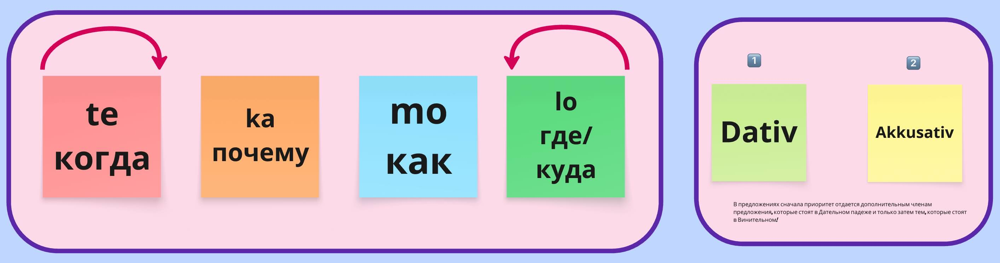

# Предложения (построение)

## Highlights

- Tekamolo: Время к началу, Локация к концу. Сначала Датив, потом Аккузатив

## TeKaMoLo

- Kasual: ПОЧЕМУ что-то проиходит (описывает причину действия)
- Modal: КАКИМ ОБРАЗОМ (описывает КАК это будет происходить)  
  *mit dem Flugzeug*
